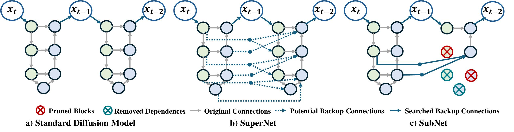
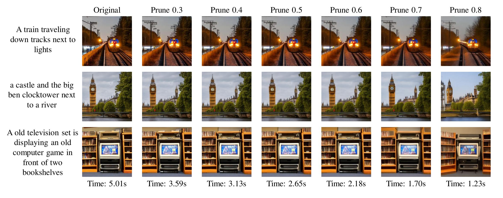
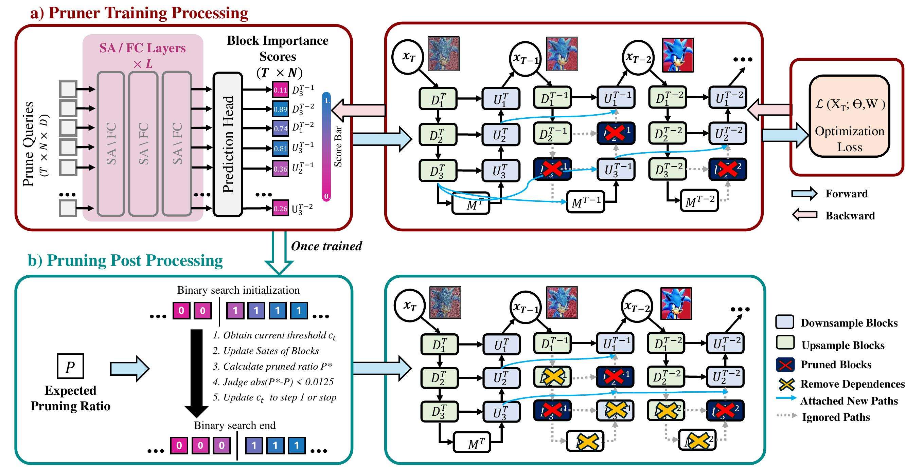

# DiP-GO: A Dffusion Pruner via Few-step Gradient Optimization
This is the official repository of  [DiP-GO: A Dffusion Pruner via Few-step Gradient Optimization]().

<hr />

## 1. Highlights




> **<p align="justify"> Abstract:** *Diffusion models have achieved remarkable progress in the field of image generation due to their outstanding capabilities. However, these models require substantial computing resources because of the multi-step denoising process during inference. While traditional pruning methods have been employed to optimize these models, the retraining process necessitates large-scale training datasets and extensive computational costs to maintain generalization ability, making it neither convenient nor efficient. Recent studies attempt to utilize the similarity of features across adjacent denoising stages to reduce computational costs through simple and static strategies. However, these strategies cannot fully harness the potential of the similar feature patterns across adjacent timesteps. In this work, we propose a novel pruning method that derives an efficient diffusion model via a more intelligent and differentiable pruner. At the core of our approach is casting the model pruning process into a SubNet search process. Specifically, we first introduce a SuperNet based on standard diffusion via adding some backup connections built upon the similar features. We then construct a plugin pruner network and design optimization losses to identify redundant computation. Finally, our method can identify an optimal SubNet through few-step gradient optimization and a simple post-processing procedure.
We conduct extensive experiments on various diffusion models including Stable Diffusion series and DiTs. Our DiP-GO approach achieves 4.4$\times$ speedup for SD-1.5 without any loss of accuracy, significantly outperforming the previous state-of-the-art methods.* </p>

<hr />

## 2. Main Contributions
1) We define a SuperNet based on standard diffusion and show how to obtain a SubNet. This transforms the diffusion optimization problem into an efficient SubNet search process without the need for retraining pretraind diffusion models.
2) We design a plugin pruner tailored specifically for diffusion models. This pruner optimizes pruning constraints while maximizing synthesis capability. Additionally, we introduce a post-processing method for the pruner to ensure that the SubNet meets specified pruning requirements.
3) We conduct extensive pruning experiments across various diffusion models, including Stable Diffusion 1.5, Stable Diffusion 2.1, Stable Diffusion XL, and DiT. Extensive experiments demonstrate the superiority of our method, achieving a notable 4.4 $\times$ speedup during inference on Stable Diffusion 1.5 without the need for retraining the diffusion model.

<hr />

## 3. Method Pipeline



Please refer to the [paper](https://arxiv.org/abs/) for more technical details.

<hr />

## 4. How to Run Experiments?
The setup and guidance are coming soon.

<hr />

## Citation

If you find our work inspiring in your research, please cite our work.

```

```

<hr />
